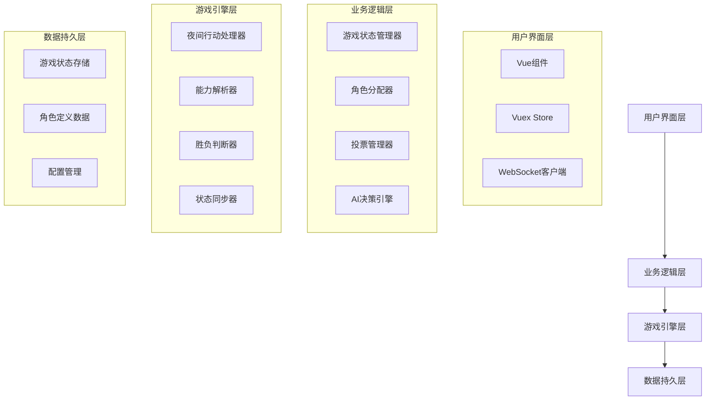
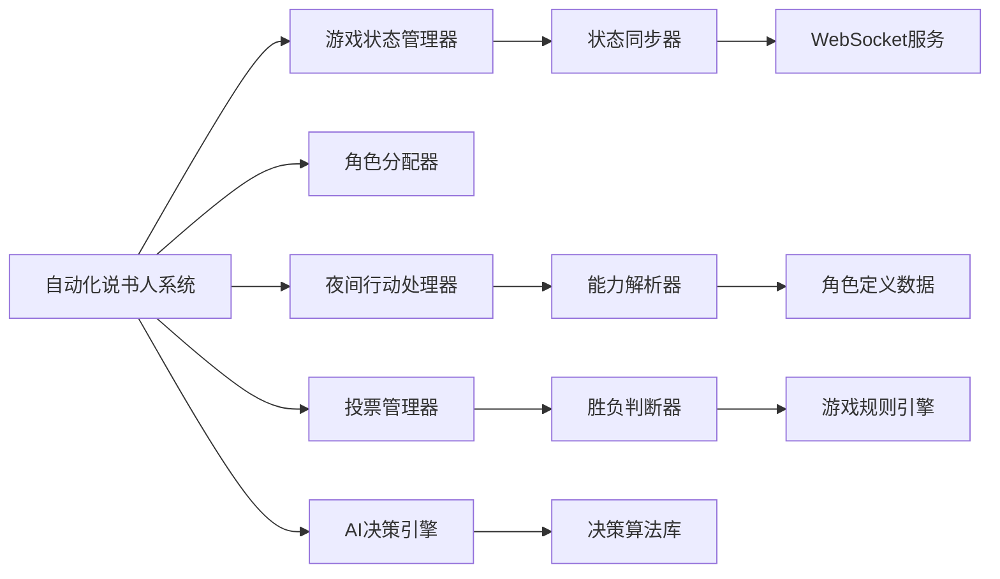

# 设计文档

## 概述

血染钟楼自动化说书人系统是一个复杂的游戏自动化解决方案，旨在将传统的手动说书人操作转换为智能化的自动流程。系统基于Vue.js 2.6和Vuex构建，通过WebSocket实现实时通信，能够自动管理游戏的完整生命周期，从角色分配到胜负判断。

核心设计理念是保持游戏规则的完整性和准确性，同时提供流畅的用户体验。系统采用事件驱动架构，通过状态机模式管理游戏阶段转换，确保所有操作都按照官方规则执行。

## 架构

### 整体架构

系统采用分层架构设计，包含以下主要层次：



### 核心模块关系



## 组件和接口

### 核心组件

#### 1. 自动化说书人系统 (AutomatedStorytellerSystem)

主控制器，协调所有子系统的工作。

```typescript
interface AutomatedStorytellerSystem {
  // 初始化系统
  initialize(gameConfig: GameConfiguration): Promise<void>
  
  // 启动自动化游戏
  startAutomatedGame(): Promise<void>
  
  // 暂停/恢复自动化
  pauseAutomation(): void
  resumeAutomation(): void
  
  // 获取当前系统状态
  getSystemStatus(): SystemStatus
  
  // 处理紧急情况
  handleEmergency(emergency: EmergencyType): void
}
```

#### 2. 游戏状态管理器 (GameStateManager)

管理游戏的整体状态和阶段转换。

```typescript
interface GameStateManager {
  // 获取当前游戏状态
  getCurrentState(): GameState
  
  // 转换游戏阶段
  transitionToPhase(phase: GamePhase): Promise<void>
  
  // 更新玩家状态
  updatePlayerState(playerId: string, state: PlayerState): void
  
  // 验证状态转换的合法性
  validateTransition(from: GamePhase, to: GamePhase): boolean
  
  // 回滚到上一个状态
  rollbackToPreviousState(): void
}
```

#### 3. 角色分配器 (RoleAssigner)

负责自动分配角色给玩家。

```typescript
interface RoleAssigner {
  // 生成角色组合
  generateRoleComposition(playerCount: number, script: ScriptType): RoleComposition
  
  // 分配角色给玩家
  assignRolesToPlayers(players: Player[], roles: RoleComposition): Promise<RoleAssignment[]>
  
  // 验证角色组合的合法性
  validateRoleComposition(composition: RoleComposition): boolean
  
  // 处理特殊角色分配逻辑
  handleSpecialRoleAssignment(role: SpecialRole, context: AssignmentContext): void
}
```

#### 4. 夜间行动处理器 (NightActionProcessor)

按顺序处理夜间阶段的所有角色能力。

```typescript
interface NightActionProcessor {
  // 开始夜间阶段
  startNightPhase(): Promise<void>
  
  // 处理单个角色的夜间行动
  processRoleAction(role: Role, player: Player): Promise<ActionResult>
  
  // 获取夜间行动顺序
  getNightOrder(activeRoles: Role[]): Role[]
  
  // 解决能力冲突
  resolveAbilityConflicts(conflicts: AbilityConflict[]): Resolution[]
  
  // 完成夜间阶段
  completeNightPhase(): Promise<NightResult>
}
```

#### 5. 投票管理器 (VotingManager)

管理白天的讨论和投票流程。

```typescript
interface VotingManager {
  // 开始白天阶段
  startDayPhase(nightResult: NightResult): Promise<void>
  
  // 处理玩家提名
  handleNomination(nominator: Player, nominee: Player): Promise<void>
  
  // 管理投票过程
  conductVoting(nominee: Player): Promise<VotingResult>
  
  // 计算投票结果
  calculateVotingResult(votes: Vote[]): VotingResult
  
  // 执行处决
  executePlayer(player: Player): Promise<void>
}
```

#### 6. AI决策引擎 (AIDecisionEngine)

为恶人阵营提供智能决策支持。

```typescript
interface AIDecisionEngine {
  // 分析当前游戏状态
  analyzeGameState(gameState: GameState): GameAnalysis
  
  // 生成决策建议
  generateDecisionSuggestions(context: DecisionContext): DecisionSuggestion[]
  
  // 评估决策的风险和收益
  evaluateDecision(decision: Decision, gameState: GameState): DecisionEvaluation
  
  // 学习和优化决策算法
  learnFromGameOutcome(gameHistory: GameHistory, outcome: GameOutcome): void
}
```

#### 7. 能力解析器 (AbilityResolver)

解析和执行各种角色能力。

```typescript
interface AbilityResolver {
  // 解析角色能力
  parseAbility(ability: Ability, context: AbilityContext): ParsedAbility
  
  // 执行能力效果
  executeAbility(parsedAbility: ParsedAbility): Promise<AbilityResult>
  
  // 验证能力使用条件
  validateAbilityConditions(ability: Ability, context: AbilityContext): boolean
  
  // 处理能力的副作用
  handleAbilitySideEffects(result: AbilityResult): void
}
```

#### 8. 胜负判断器 (VictoryConditionChecker)

检查和判断游戏的胜负条件。

```typescript
interface VictoryConditionChecker {
  // 检查胜利条件
  checkVictoryConditions(gameState: GameState): VictoryResult
  
  // 验证游戏是否结束
  isGameEnded(gameState: GameState): boolean
  
  // 生成游戏结果报告
  generateGameReport(gameState: GameState, outcome: GameOutcome): GameReport
  
  // 处理特殊胜利条件
  handleSpecialVictoryConditions(conditions: SpecialCondition[]): VictoryResult
}
```

### 数据接口

#### 游戏状态接口

```typescript
interface GameState {
  gameId: string
  phase: GamePhase
  day: number
  players: Player[]
  deadPlayers: Player[]
  nominations: Nomination[]
  votes: Vote[]
  nightActions: NightAction[]
  gameConfiguration: GameConfiguration
  timestamp: number
}

interface Player {
  id: string
  name: string
  role: Role
  isAlive: boolean
  isEvil: boolean
  abilities: Ability[]
  status: PlayerStatus
  votes: number
  ghostVoteUsed: boolean
}

interface Role {
  id: string
  name: string
  type: RoleType
  team: Team
  ability: Ability
  nightOrder: number
  firstNightOrder?: number
}
```

## 数据模型

### 核心数据结构

#### 游戏配置模型

```typescript
interface GameConfiguration {
  scriptType: ScriptType
  playerCount: number
  automationLevel: AutomationLevel
  aiDifficulty: AIDifficulty
  timeSettings: TimeSettings
  ruleVariants: RuleVariant[]
  debugMode: boolean
}

interface TimeSettings {
  discussionTime: number
  nominationTime: number
  votingTime: number
  nightActionTimeout: number
}
```

#### 角色和能力模型

```typescript
interface Ability {
  id: string
  name: string
  description: string
  type: AbilityType
  timing: AbilityTiming
  conditions: AbilityCondition[]
  effects: AbilityEffect[]
  priority: number
}

interface AbilityEffect {
  type: EffectType
  target: TargetType
  value: any
  duration: EffectDuration
}
```

#### 决策和AI模型

```typescript
interface DecisionContext {
  gameState: GameState
  playerPerspective: Player
  availableActions: Action[]
  timeRemaining: number
  riskTolerance: number
}

interface DecisionSuggestion {
  action: Action
  confidence: number
  reasoning: string
  expectedOutcome: OutcomePrediction
  risks: Risk[]
  alternatives: AlternativeAction[]
}
```

### 状态管理架构

使用Vuex进行状态管理，采用模块化设计：

```typescript
// Vuex Store 结构
interface RootState {
  game: GameState
  automation: AutomationState
  ui: UIState
  websocket: WebSocketState
}

// 游戏状态模块
const gameModule = {
  namespaced: true,
  state: () => ({
    currentGame: null,
    players: [],
    gamePhase: GamePhase.SETUP,
    nightActions: [],
    votingResults: []
  }),
  mutations: {
    SET_GAME_STATE,
    UPDATE_PLAYER_STATE,
    TRANSITION_PHASE,
    ADD_NIGHT_ACTION,
    RECORD_VOTE
  },
  actions: {
    initializeGame,
    updateGameState,
    processNightActions,
    handleVoting
  }
}
```

## 正确性属性

*属性是一个特征或行为，应该在系统的所有有效执行中保持为真——本质上是关于系统应该做什么的正式声明。属性作为人类可读规范和机器可验证正确性保证之间的桥梁。*

基于需求分析和预工作，以下是系统必须满足的核心正确性属性：

### 属性 1: 角色分配正确性
*对于任何*玩家数量和脚本类型，自动分配的角色组合应该符合官方规则（好人、恶人、外来者数量平衡），并且每个玩家都应该收到正确的角色信息
**验证需求: 1.1, 1.2, 1.3**

### 属性 2: 夜间行动顺序正确性
*对于任何*角色组合，夜间行动处理器应该按照官方夜间顺序处理所有角色能力，并正确解析能力效果更新游戏状态
**验证需求: 2.1, 2.2**

### 属性 3: 能力冲突解决正确性
*对于任何*发生冲突的能力组合，系统应该按照优先级规则正确解决冲突，确保游戏状态的一致性
**验证需求: 2.3**

### 属性 4: 死亡角色处理正确性
*对于任何*死亡的角色，系统应该正确移除其后续夜间行动，并更新相关的游戏状态
**验证需求: 2.4**

### 属性 5: 游戏阶段转换正确性
*对于任何*游戏阶段的完成，系统应该自动转换到下一个正确的阶段（夜晚→白天，白天→夜晚）
**验证需求: 2.5, 3.5**

### 属性 6: 投票统计正确性
*对于任何*投票场景，投票管理器应该实时准确统计票数，并根据票数正确决定是否处决玩家
**验证需求: 3.3, 3.4**

### 属性 7: 胜负判断正确性
*对于任何*游戏状态，胜负判断器应该正确检查胜利条件，并在满足条件时立即结束游戏并公布结果
**验证需求: 4.1, 4.2, 4.3, 4.5**

### 属性 8: 状态同步一致性
*对于任何*游戏状态变化，状态同步器应该确保所有客户端最终达到一致状态，包括处理网络问题和重连场景
**验证需求: 6.1, 6.2, 6.3, 6.5**

### 属性 9: 能力解析执行正确性
*对于任何*角色能力的使用，能力解析器应该正确解析能力效果、验证使用条件、应用效果到目标，并在出错时回滚状态
**验证需求: 7.1, 7.2, 7.3, 7.4, 7.5**

### 属性 10: 配置管理往返一致性
*对于任何*有效的游戏配置，保存然后加载配置应该产生等价的配置对象，系统应该正确应用配置参数
**验证需求: 8.1, 8.4, 8.5**

### 属性 11: AI决策输出格式正确性
*对于任何*需要AI决策的场景，AI决策引擎应该提供包含多个选项和理由说明的结构化建议
**验证需求: 5.1, 5.3**

### 属性 12: 错误处理和恢复正确性
*对于任何*系统错误（角色分配错误、状态同步失败等），系统应该记录错误、尝试恢复，并维护游戏状态的完整性
**验证需求: 1.5, 6.4, 7.5**

## 错误处理

### 错误分类和处理策略

#### 1. 系统级错误
- **网络连接中断**: 实现自动重连机制，缓存未发送的状态更新
- **服务器崩溃**: 实现游戏状态持久化，支持从最后保存点恢复
- **内存不足**: 实现优雅降级，减少非关键功能的内存使用

#### 2. 游戏逻辑错误
- **角色分配失败**: 记录错误原因，重新生成角色组合
- **能力解析错误**: 回滚到能力执行前的状态，记录详细错误信息
- **状态不一致**: 触发状态修复机制，从权威源重新同步

#### 3. 用户输入错误
- **无效配置**: 提供详细的验证错误信息，建议正确的配置格式
- **非法操作**: 阻止操作执行，向用户说明操作不被允许的原因
- **超时操作**: 实现默认行为，确保游戏流程不被阻塞

### 错误恢复机制

```typescript
interface ErrorRecoveryStrategy {
  // 错误检测
  detectError(context: SystemContext): Error[]
  
  // 错误分类
  classifyError(error: Error): ErrorCategory
  
  // 恢复策略选择
  selectRecoveryStrategy(error: Error): RecoveryStrategy
  
  // 执行恢复
  executeRecovery(strategy: RecoveryStrategy): Promise<RecoveryResult>
  
  // 验证恢复结果
  validateRecovery(result: RecoveryResult): boolean
}
```

## 测试策略

### 双重测试方法

系统采用单元测试和基于属性的测试相结合的综合测试策略：

#### 单元测试
- **具体示例验证**: 测试特定的游戏场景和边缘情况
- **集成点测试**: 验证组件之间的接口和数据流
- **错误条件测试**: 测试各种错误情况下的系统行为
- **性能基准测试**: 确保关键操作在可接受的时间内完成

#### 基于属性的测试
- **通用正确性验证**: 通过随机化输入验证通用属性
- **全面输入覆盖**: 测试大量随机生成的游戏状态和配置
- **边界条件探索**: 自动发现可能导致失败的边界情况
- **回归测试**: 确保新功能不会破坏现有的正确性属性

### 测试配置要求

#### 基于属性的测试配置
- **最小迭代次数**: 每个属性测试至少运行100次迭代
- **测试库选择**: 使用fast-check（JavaScript/TypeScript）进行属性测试
- **标签格式**: 每个属性测试必须包含注释标签
  - 格式: `// Feature: automated-storyteller, Property {number}: {property_text}`
- **单一属性映射**: 每个正确性属性对应一个属性测试

#### 测试数据生成策略
- **角色组合生成**: 生成符合不同脚本规则的随机角色组合
- **游戏状态生成**: 创建各种游戏阶段的随机状态
- **玩家行为模拟**: 模拟真实玩家的决策和行为模式
- **网络条件模拟**: 模拟各种网络延迟和连接问题

### 测试环境和工具

#### 开发环境测试
```typescript
// 示例属性测试配置
describe('Automated Storyteller Properties', () => {
  // Feature: automated-storyteller, Property 1: 角色分配正确性
  it('should assign valid role compositions for any player count', () => {
    fc.assert(fc.property(
      fc.integer(5, 20), // 玩家数量
      fc.constantFrom('trouble-brewing', 'sects-violets', 'bad-moon-rising'), // 脚本类型
      (playerCount, scriptType) => {
        const composition = roleAssigner.generateRoleComposition(playerCount, scriptType);
        return validateRoleComposition(composition) && 
               composition.totalPlayers === playerCount;
      }
    ), { numRuns: 100 });
  });
});
```

#### 集成测试环境
- **模拟WebSocket服务器**: 测试实时通信功能
- **多客户端模拟**: 验证多玩家场景下的状态同步
- **性能监控**: 监控关键操作的执行时间和资源使用

#### 端到端测试
- **完整游戏流程**: 从游戏创建到结束的完整自动化测试
- **AI决策验证**: 验证AI在不同游戏状态下的决策合理性
- **用户体验测试**: 确保自动化不会影响用户的游戏体验

### 测试覆盖率要求

- **代码覆盖率**: 核心游戏逻辑代码覆盖率不低于90%
- **属性覆盖率**: 所有定义的正确性属性都必须有对应的属性测试
- **场景覆盖率**: 覆盖所有主要的游戏场景和边缘情况
- **错误路径覆盖率**: 测试所有定义的错误处理路径