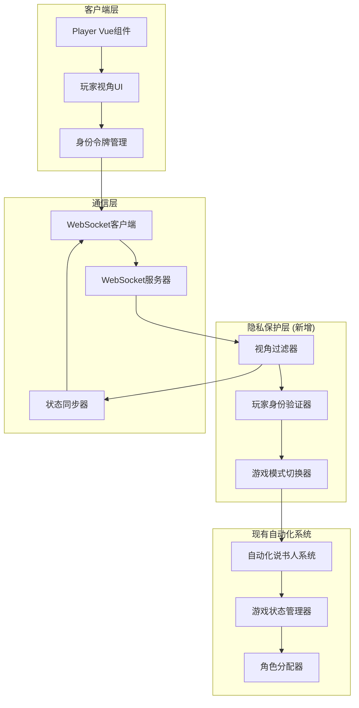
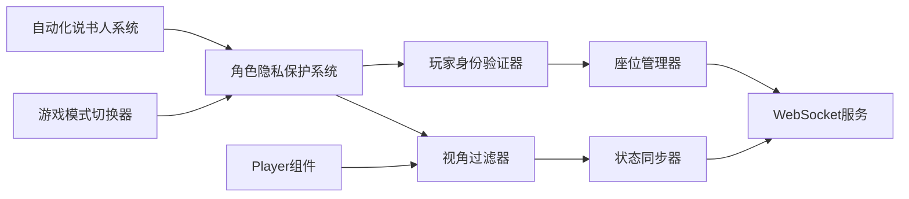

# 设计文档

## 概述

无说书人自动化模式（Player-Only Mode）是对现有自动化说书人系统的关键扩展，通过实现角色隐私保护机制，使玩家能够在完全没有人类说书人的情况下进行游戏。系统的核心设计理念是"隐形说书人"：系统掌握所有游戏信息并自动处理游戏逻辑，但每个玩家只能看到自己的角色卡，其他玩家的角色对其完全隐藏。

该设计基于现有的Vue.js 2.6 + Vuex架构和WebSocket实时通信系统，通过添加视角过滤层、身份验证机制和游戏模式切换功能来实现角色隐私保护。关键技术挑战包括：在服务器端过滤敏感信息、客户端状态管理、断线重连时的身份验证，以及与现有自动化说书人系统的无缝集成。

## 架构

### 整体架构

无说书人模式在现有架构基础上添加了隐私保护层：



### 核心模块关系



## 组件和接口

### 核心组件

#### 1. 角色隐私保护系统 (RolePrivacySystem)

主控制器，协调隐私保护的所有子系统。

```typescript
interface RolePrivacySystem {
  // 初始化隐私保护系统
  initialize(gameMode: GameMode): void
  
  // 启用/禁用隐私保护
  enablePrivacyProtection(): void
  disablePrivacyProtection(): void
  
  // 检查当前模式
  isPlayerOnlyMode(): boolean
  
  // 过滤游戏状态
  filterGameStateForPlayer(
    gameState: GameState, 
    playerId: string
  ): FilteredGameState
  
  // 验证访问权限
  canPlayerAccessRole(
    playerId: string, 
    targetPlayerId: string
  ): boolean
}
```

#### 2. 视角过滤器 (PerspectiveFilter)

根据玩家身份过滤游戏状态中的敏感信息。

```typescript
interface PerspectiveFilter {
  // 过滤完整游戏状态
  filterGameState(
    gameState: GameState,
    playerId: string
  ): FilteredGameState
  
  // 过滤玩家信息
  filterPlayer(
    player: Player,
    viewerId: string,
    isGameEnded: boolean
  ): FilteredPlayer
  
  // 分类信息类型
  classifyInformation(info: GameInformation): InformationType
  
  // 过滤夜间信息
  filterNightInformation(
    nightInfo: NightInformation[],
    playerId: string
  ): NightInformation[]
  
  // 检查信息可见性
  isInformationVisibleTo(
    info: GameInformation,
    playerId: string
  ): boolean
}
```

#### 3. 玩家身份验证器 (PlayerAuthenticator)

管理玩家身份令牌和座位认领。

```typescript
interface PlayerAuthenticator {
  // 生成身份令牌
  generatePlayerToken(playerId: string, seatIndex: number): PlayerToken
  
  // 验证身份令牌
  validateToken(token: PlayerToken): TokenValidationResult
  
  // 认领座位
  claimSeat(
    playerId: string,
    seatIndex: number
  ): Promise<ClaimResult>
  
  // 释放座位
  releaseSeat(playerId: string): void
  
  // 获取玩家座位
  getPlayerSeat(playerId: string): number
  
  // 检查座位是否已认领
  isSeatClaimed(seatIndex: number): boolean
  
  // 处理断线重连
  handleReconnection(
    playerId: string,
    token: PlayerToken
  ): Promise<ReconnectionResult>
  
  // 清理过期令牌
  cleanupExpiredTokens(): void
}
```

#### 4. 游戏模式切换器 (ModeSwitcher)

管理说书人模式和无说书人模式之间的切换。

```typescript
interface ModeSwitcher {
  // 获取当前游戏模式
  getCurrentMode(): GameMode
  
  // 切换游戏模式
  switchMode(mode: GameMode): Promise<void>
  
  // 验证是否可以切换模式
  canSwitchMode(): boolean
  
  // 通知客户端模式变化
  notifyModeChange(mode: GameMode): void
  
  // 应用模式配置
  applyModeConfiguration(mode: GameMode): void
}
```

#### 5. 座位管理器 (SeatManager)

管理座位状态和玩家-座位映射关系。

```typescript
interface SeatManager {
  // 获取所有座位状态
  getAllSeats(): SeatStatus[]
  
  // 获取空座位列表
  getAvailableSeats(): number[]
  
  // 绑定玩家到座位
  bindPlayerToSeat(playerId: string, seatIndex: number): void
  
  // 解绑玩家
  unbindPlayer(playerId: string): void
  
  // 获取座位的玩家ID
  getPlayerIdBySeat(seatIndex: number): string | null
  
  // 检查玩家是否已就座
  isPlayerSeated(playerId: string): boolean
}
```

### 数据接口

#### 游戏模式和隐私相关接口

```typescript
enum GameMode {
  STORYTELLER = 'storyteller',    // 说书人模式
  PLAYER_ONLY = 'player-only'     // 无说书人模式
}

enum InformationType {
  PUBLIC = 'public',        // 公开信息
  PRIVATE = 'private',      // 私密信息
  ROLE = 'role'            // 角色信息
}

interface PlayerToken {
  playerId: string
  seatIndex: number
  token: string
  issuedAt: number
  expiresAt: number
}

interface TokenValidationResult {
  isValid: boolean
  playerId?: string
  seatIndex?: number
  reason?: string
}

interface ClaimResult {
  success: boolean
  token?: PlayerToken
  error?: string
}

interface ReconnectionResult {
  success: boolean
  gameState?: FilteredGameState
  error?: string
}

interface SeatStatus {
  index: number
  isClaimed: boolean
  playerId: string | null
  claimedAt: number | null
}
```

#### 过滤后的游戏状态接口

```typescript
interface FilteredGameState {
  gameId: string
  mode: GameMode
  phase: GamePhase
  day: number
  
  // 玩家列表（角色信息已过滤）
  players: FilteredPlayer[]
  
  // 公开信息
  publicInformation: PublicInformation
  
  // 私密信息（仅当前玩家）
  privateInformation?: PrivateInformation
  
  // 游戏配置
  gameConfiguration: GameConfiguration
}

interface FilteredPlayer {
  id: string
  name: string
  seatIndex: number
  
  // 公开信息
  isAlive: boolean
  isDead: boolean
  isVoteless: boolean
  pronouns?: string
  
  // 角色信息（仅自己可见）
  role?: Role
  
  // 角色卡显示状态
  roleCardVisible: boolean  // true表示显示正面，false表示显示背面
}

interface PublicInformation {
  deadPlayers: number[]
  votingResults: VotingResult[]
  currentPhase: GamePhase
  dayNumber: number
  nominations: Nomination[]
}

interface PrivateInformation {
  myRole: Role
  nightInformation: NightInformation[]
  abilityResults: AbilityResult[]
}
```

## 数据模型

### 隐私保护配置模型

```typescript
interface PrivacyConfiguration {
  mode: GameMode
  enableRoleHiding: boolean
  enableNightInfoProtection: boolean
  tokenExpirationTime: number  // 令牌过期时间（毫秒）
  reconnectionTimeout: number  // 重连超时时间（毫秒）
  logAccessAttempts: boolean   // 是否记录访问尝试
}

interface AccessLog {
  timestamp: number
  playerId: string
  action: string
  targetPlayerId?: string
  success: boolean
  reason?: string
}
```

### 座位和令牌管理模型

```typescript
interface SeatBinding {
  seatIndex: number
  playerId: string
  token: PlayerToken
  claimedAt: number
  lastActivity: number
}

interface TokenStore {
  tokens: Map<string, PlayerToken>  // playerId -> token
  seatBindings: Map<number, SeatBinding>  // seatIndex -> binding
  expirationQueue: PriorityQueue<PlayerToken>
}
```

### 状态同步架构

扩展现有的Vuex store，添加隐私保护模块：

```typescript
// Vuex Store 结构扩展
interface RootState {
  game: GameState
  automation: AutomationState
  ui: UIState
  websocket: WebSocketState
  privacy: PrivacyState  // 新增
}

// 隐私保护状态模块
const privacyModule = {
  namespaced: true,
  state: () => ({
    gameMode: GameMode.STORYTELLER,
    myPlayerId: null,
    mySeatIndex: -1,
    myToken: null,
    isPrivacyEnabled: false,
    accessLogs: []
  }),
  mutations: {
    SET_GAME_MODE,
    SET_PLAYER_ID,
    SET_SEAT_INDEX,
    SET_TOKEN,
    ENABLE_PRIVACY,
    DISABLE_PRIVACY,
    ADD_ACCESS_LOG
  },
  actions: {
    claimSeat,
    releaseSeat,
    switchGameMode,
    handleReconnection
  },
  getters: {
    isPlayerOnlyMode,
    canSeeRole,
    getVisiblePlayers
  }
}
```

## 正确性属性

*属性是一个特征或行为，应该在系统的所有有效执行中保持为真——本质上是关于系统应该做什么的正式声明。属性作为人类可读规范和机器可验证正确性保证之间的桥梁。*

基于需求分析和预工作，以下是系统必须满足的核心正确性属性：

### 属性 1: 角色可见性隔离
*对于任何*游戏状态和玩家身份，当玩家查看游戏界面时，应该只能看到自己的角色卡正面，其他所有玩家的角色卡应该显示为背面或隐藏状态
**验证需求: 1.1, 1.2, 5.1, 5.2**

### 属性 2: 系统全知但不泄露
*对于任何*游戏状态，系统内部应该包含所有玩家的完整角色信息，但发送给任何客户端的数据都不应该包含该客户端玩家以外的角色信息
**验证需求: 1.3, 7.1**

### 属性 3: 非法访问阻止
*对于任何*玩家尝试访问其他玩家角色信息的请求，系统应该拒绝访问并记录该尝试
**验证需求: 1.4, 7.2, 7.3**

### 属性 4: 座位认领唯一性
*对于任何*座位，在任何时刻最多只能被一个玩家认领，并且每次认领都应该生成唯一的身份令牌
**验证需求: 2.2, 2.3**

### 属性 5: 令牌验证正确性
*对于任何*身份令牌，验证过程应该正确判断令牌的有效性，无效令牌应该被拒绝并要求重新认领座位
**验证需求: 2.4, 2.5, 8.2, 8.5**

### 属性 6: 游戏模式切换限制
*对于任何*游戏状态，如果游戏已经开始，则不应该允许切换游戏模式；模式切换时应该通知所有客户端
**验证需求: 3.4, 3.5**

### 属性 7: 视角过滤一致性
*对于任何*游戏状态同步请求，视角过滤器应该根据请求者的身份返回正确过滤后的状态，确保私密信息不泄露
**验证需求: 4.1, 4.5, 8.3**

### 属性 8: 公开信息广播
*对于任何*公开信息（玩家存活状态、投票结果），应该向所有玩家广播，所有玩家都应该能看到相同的公开信息
**验证需求: 4.2, 4.3, 5.5**

### 属性 9: 私密信息隔离
*对于任何*私密信息（夜间信息、角色能力结果），应该只发送给相关玩家，其他玩家不应该能够访问
**验证需求: 4.4, 9.1, 9.3, 9.4**

### 属性 10: 自动化系统集成
*对于任何*游戏流程（角色分配、夜间行动、投票），在无说书人模式下应该正常工作，并且不向玩家泄露其他玩家的角色信息
**验证需求: 6.1, 6.2, 6.3, 6.4**

### 属性 11: 断线重连恢复
*对于任何*断线的玩家，重新连接时应该能够通过有效令牌恢复其座位和视角，并接收到过滤后的完整游戏状态
**验证需求: 8.1, 8.2, 8.3**

### 属性 12: 超时座位释放
*对于任何*长时间断线的玩家，超过超时时间后其座位应该被释放，令牌应该失效
**验证需求: 8.4**

### 属性 13: 配置往返一致性
*对于任何*有效的游戏配置（包含游戏模式），保存然后加载配置应该产生等价的配置对象，游戏模式应该正确恢复
**验证需求: 10.1, 10.2, 10.4**

### 属性 14: 配置验证和默认值
*对于任何*无效的游戏配置，系统应该使用默认的说书人模式，并验证导入配置的有效性
**验证需求: 10.3, 10.5**

### 属性 15: 游戏结束角色公开
*对于任何*游戏，当游戏结束时，所有玩家的角色应该对所有人可见，隐私保护应该解除
**验证需求: 1.5, 6.5**

## 错误处理

### 错误分类和处理策略

#### 1. 身份验证错误
- **无效令牌**: 拒绝访问，要求重新认领座位，记录尝试
- **令牌过期**: 清理过期令牌，释放座位，通知玩家重新认领
- **座位已被占用**: 返回错误信息，提示选择其他座位
- **重复认领**: 检测并阻止同一玩家认领多个座位

#### 2. 隐私保护错误
- **非法访问尝试**: 阻止访问，记录详细日志，可选地断开连接
- **过滤器失败**: 回退到最严格的过滤策略（隐藏所有敏感信息）
- **状态同步失败**: 重试同步，确保客户端最终获得正确的过滤状态

#### 3. 模式切换错误
- **游戏进行中切换**: 阻止切换，返回错误信息
- **配置冲突**: 验证配置兼容性，使用安全的默认值
- **通知失败**: 重试通知，确保所有客户端知道模式变化

#### 4. 断线重连错误
- **令牌不匹配**: 拒绝重连，要求重新认领座位
- **座位已被其他玩家占用**: 通知冲突，提供解决方案
- **状态恢复失败**: 重新发送完整的过滤状态

### 错误恢复机制

```typescript
interface PrivacyErrorHandler {
  // 处理身份验证错误
  handleAuthenticationError(
    error: AuthenticationError,
    context: AuthContext
  ): ErrorRecoveryAction
  
  // 处理访问控制错误
  handleAccessControlError(
    error: AccessControlError,
    context: AccessContext
  ): ErrorRecoveryAction
  
  // 处理过滤器错误
  handleFilterError(
    error: FilterError,
    gameState: GameState
  ): FilteredGameState
  
  // 记录安全事件
  logSecurityEvent(event: SecurityEvent): void
}
```

## 测试策略

### 双重测试方法

系统采用单元测试和基于属性的测试相结合的综合测试策略：

#### 单元测试
- **具体场景验证**: 测试特定的座位认领、模式切换场景
- **边界条件测试**: 测试令牌过期、座位满员等边界情况
- **错误处理测试**: 测试各种错误情况下的系统行为
- **集成测试**: 验证与现有自动化说书人系统的集成

#### 基于属性的测试
- **隐私保护验证**: 通过随机游戏状态验证角色信息不泄露
- **过滤器正确性**: 测试大量随机状态下的过滤结果
- **令牌安全性**: 验证令牌生成和验证的安全性
- **状态一致性**: 确保客户端和服务器状态一致

### 测试配置要求

#### 基于属性的测试配置
- **最小迭代次数**: 每个属性测试至少运行100次迭代
- **测试库选择**: 使用fast-check（JavaScript/TypeScript）进行属性测试
- **标签格式**: 每个属性测试必须包含注释标签
  - 格式: `// Feature: player-only-mode, Property {number}: {property_text}`
- **单一属性映射**: 每个正确性属性对应一个属性测试

#### 测试数据生成策略
- **游戏状态生成**: 生成各种玩家数量和游戏阶段的随机状态
- **玩家身份生成**: 创建随机的玩家ID和座位分配
- **令牌生成**: 生成有效、过期、无效的各种令牌
- **访问请求模拟**: 模拟合法和非法的访问请求

### 测试环境和工具

#### 开发环境测试
```typescript
// 示例属性测试配置
describe('Player-Only Mode Properties', () => {
  // Feature: player-only-mode, Property 1: 角色可见性隔离
  it('should only show own role to each player', () => {
    fc.assert(fc.property(
      fc.array(fc.record({
        id: fc.string(),
        name: fc.string(),
        role: fc.constantFrom(...allRoles)
      }), { minLength: 5, maxLength: 20 }),
      (players) => {
        const gameState = createGameState(players);
        return players.every((player, index) => {
          const filtered = perspectiveFilter.filterGameState(
            gameState,
            player.id
          );
          // 验证只能看到自己的角色
          return filtered.players.every((p, i) => 
            i === index ? p.roleCardVisible : !p.roleCardVisible
          );
        });
      }
    ), { numRuns: 100 });
  });
  
  // Feature: player-only-mode, Property 4: 座位认领唯一性
  it('should ensure seat uniqueness and token uniqueness', () => {
    fc.assert(fc.property(
      fc.array(fc.tuple(fc.string(), fc.integer(0, 19)), { minLength: 5 }),
      (claimRequests) => {
        const seatManager = new SeatManager();
        const tokens = new Set();
        const seats = new Map();
        
        claimRequests.forEach(([playerId, seatIndex]) => {
          const result = seatManager.claimSeat(playerId, seatIndex);
          if (result.success) {
            // 验证令牌唯一性
            if (tokens.has(result.token.token)) return false;
            tokens.add(result.token.token);
            
            // 验证座位唯一性
            if (seats.has(seatIndex)) return false;
            seats.set(seatIndex, playerId);
          }
        });
        return true;
      }
    ), { numRuns: 100 });
  });
});
```

#### 安全性测试
- **渗透测试**: 模拟恶意客户端尝试访问其他玩家角色
- **令牌安全测试**: 验证令牌无法被伪造或篡改
- **重放攻击测试**: 验证过期令牌无法被重用
- **信息泄露测试**: 确保网络传输中不包含敏感信息

#### 性能测试
- **过滤性能**: 测试大量玩家时的过滤性能
- **令牌验证性能**: 测试高并发下的令牌验证
- **状态同步性能**: 测试频繁状态更新时的性能

### 测试覆盖率要求

- **代码覆盖率**: 隐私保护相关代码覆盖率不低于95%
- **属性覆盖率**: 所有定义的正确性属性都必须有对应的属性测试
- **场景覆盖率**: 覆盖所有主要的隐私保护场景和边缘情况
- **安全测试覆盖率**: 测试所有已知的安全威胁场景
